# AKS Store Demo DevOps Project

## Project Overview

This project demonstrates the deployment of a microservices-based e-commerce application on Azure Kubernetes Service (AKS).

The platform includes multiple backend and frontend services containerized with Docker and orchestrated using Kubernetes.

## Technologies Used

- Azure Kubernetes Service (AKS)
- Azure Container Registry (ACR)
- Docker
- Kubernetes
- Helm
- Azure DevOps Pipelines
- Terraform
- RabbitMQ
- MongoDB
- Microservices Architecture

---

## Project Goals

- Build and manage containerized microservices
- Deploy applications to AKS
- Implement CI/CD pipelines
- Use Azure cloud-native services
- Practice production-style Kubernetes deployments
- Push Docker images automatically to Azure Container Registry
- Deploy applications automatically with Helm and Azure DevOps

---

# Architecture

The application contains the following services:

| Service | Description |
|---|---|
| `makeline-service` | Processes orders from the queue and completes them (Golang) |
| `order-service` | Places customer orders (JavaScript) |
| `product-service` | Handles product CRUD operations (Rust) |
| `store-front` | Customer frontend web application (Vue.js) |
| `store-admin` | Admin panel for store employees (Vue.js) |
| `virtual-customer` | Simulates customer order creation (Rust) |
| `virtual-worker` | Simulates order completion workers (Rust) |
| `ai-service` | Optional AI service for text/image generation (Python) |
| `mongodb` | MongoDB database |
| `rabbitmq` | RabbitMQ message queue |


---


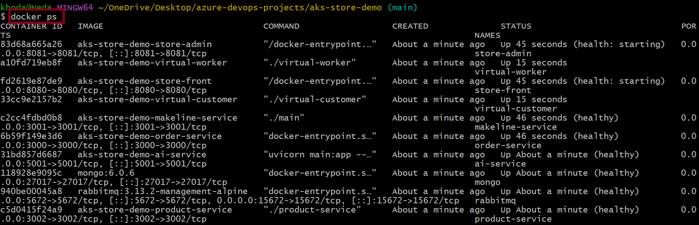

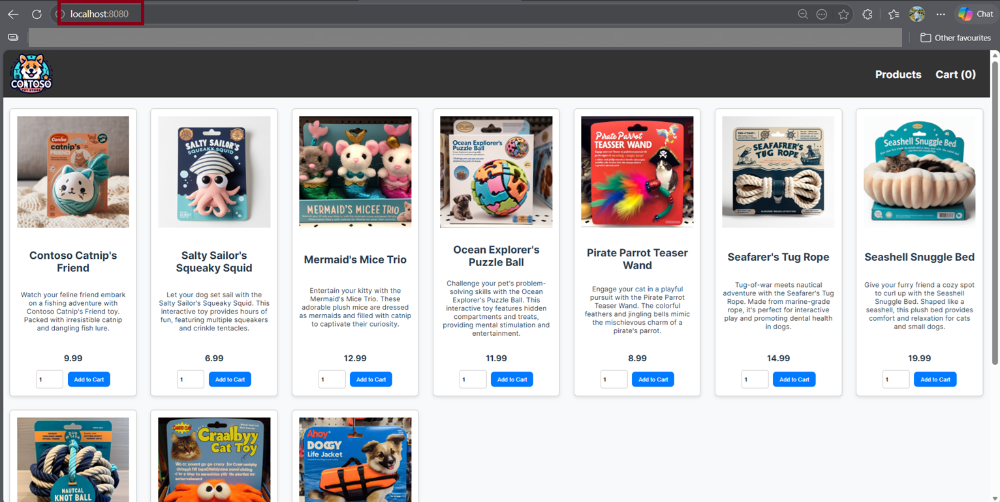

# Local Development with Docker Compose

The application was first tested locally using Docker Compose.

Docker Compose starts all backend services, frontend applications, RabbitMQ, and MongoDB using the `docker-compose.yml` file.

```bash
docker compose up -d
docker ps
```

---


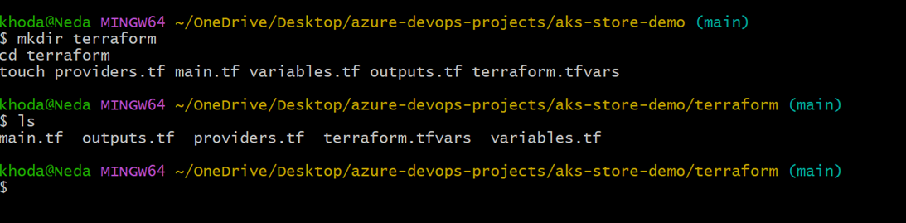

# Terraform Infrastructure Deployment

Terraform was used to provision Azure cloud infrastructure.

## Resources Created with Terraform

- Azure Resource Group
- Azure Kubernetes Service (AKS)
- Azure Container Registry (ACR)
- AKS Node Pool
- AKS Managed Identity
- ACR Pull Role Assignment
- Networking Resources
- Resource Tags

## Terraform Features

- Reusable variables
- Environment-based configuration
- Managed Identity integration
- Infrastructure validation using Terraform plan
- Infrastructure-as-Code approach

## Terraform Commands

```bash
terraform init
terraform validate
terraform plan
terraform apply
```

---


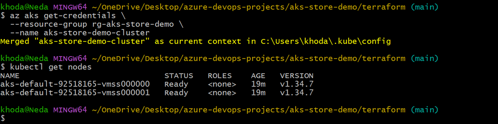

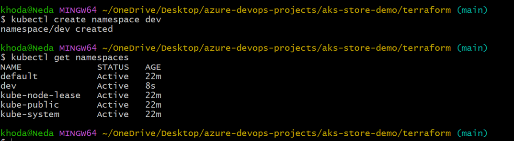

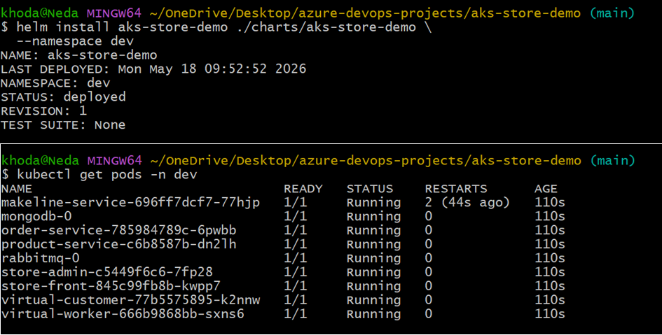

# Azure Kubernetes Service (AKS)

The Kubernetes cluster was deployed on Azure AKS.

## AKS Features Used

- Managed Kubernetes cluster
- Multiple worker nodes
- Linux node pool
- Azure-managed control plane
- kubectl access configuration

## Verify AKS Cluster

```bash

az aks get-credentials --resource-group rg-aks-store-demo --name aks-store-demo-cluster --overwrite-existing
kubectl get nodes
kubectl get namespaces
```

---


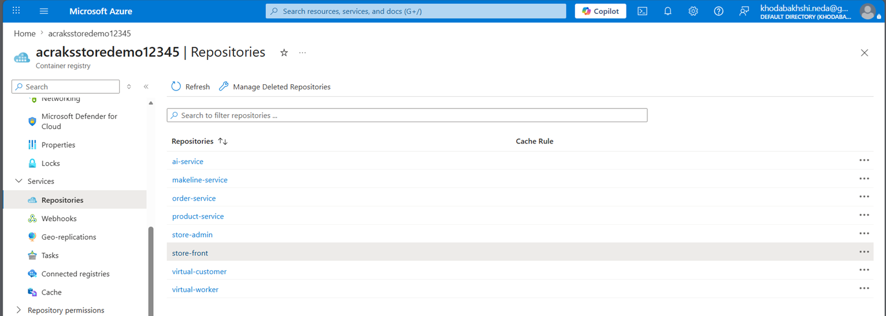

# Azure Container Registry (ACR)

Azure Container Registry was used to store all Docker images for the project.

## Images Stored in ACR

- store-front
- store-admin
- makeline-service
- order-service
- product-service
- virtual-customer
- virtual-worker
- ai-service

## Login to ACR

```bash
az acr login --name acraksstoredemo12345
```

---

# Docker Image Build Process

Each microservice contains its own Dockerfile.

The images were built locally and later automated through Azure DevOps Pipelines.

## Example Docker Build

```bash
docker build -t store-front ./src/store-front
```

## Example Docker Tag

```bash
docker tag store-front acraksstoredemo12345.azurecr.io/store-front:latest
```

## Example Docker Push

```bash
docker push acraksstoredemo12345.azurecr.io/store-front:latest
```

---

# Helm Deployment

Helm was used to manage Kubernetes deployments.

The application uses a Helm chart located inside:

```text
charts/aks-store-demo
```

## Helm Features Used

- Reusable values.yaml
- Dynamic image repositories
- Kubernetes Deployments
- Kubernetes Services
- Health probes
- LoadBalancer service exposure

## Helm Deploy Command

```bash
helm upgrade --install aks-store-demo ./charts/aks-store-demo -n dev --create-namespace
```

---


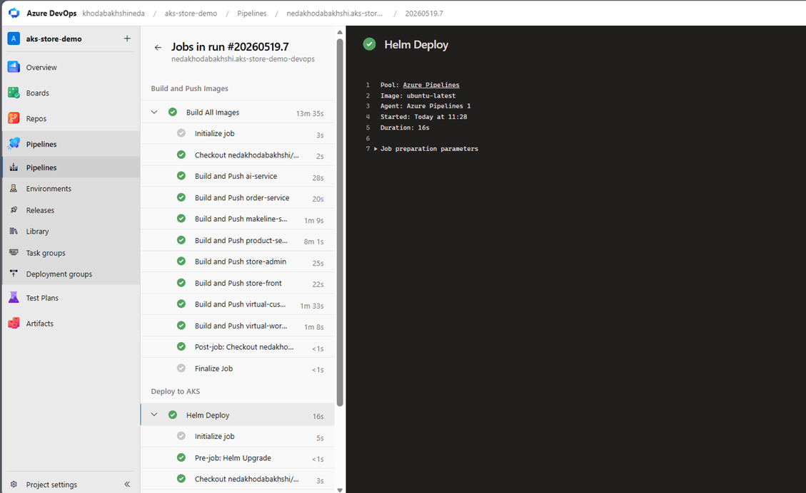

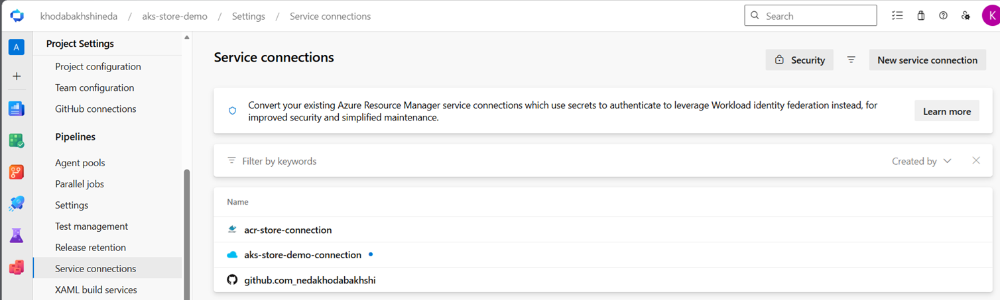

# Azure DevOps CI/CD Pipeline

Azure DevOps Pipelines was configured for full CI/CD automation.

## Pipeline Stages

### Build Stage

The pipeline automatically:

- Builds Docker images for all services
- Tags images
- Pushes images to Azure Container Registry

### Deploy Stage

The pipeline automatically:

- Connects to AKS
- Runs Helm upgrade
- Deploys updated services to Kubernetes

---

# Azure DevOps Pipeline Features

- Multi-stage pipeline
- Docker build automation
- Docker push automation
- Helm deployment automation
- AKS integration
- Continuous Deployment workflow

---

# Kubernetes Verification Commands

## Verify Pods

```bash
kubectl get pods -n dev
```

## Verify Services

```bash
kubectl get svc -n dev
```

## Verify Deployments

```bash
kubectl get deployments -n dev
```

---

# Troubleshooting Performed

During the project several real-world Kubernetes and CI/CD issues were resolved:

- Helm YAML syntax errors
- Invalid image repository formatting
- Azure DevOps pipeline deployment failures
- Kubernetes rollout timeout issues
- AKS to ACR authentication problems
- ImagePullBackOff troubleshooting
- Rolling update behavior analysis
- ACR role propagation delays

---

# Final Result

The final architecture successfully demonstrates:

- Microservices deployment on AKS
- Docker image management with ACR
- CI/CD automation using Azure DevOps
- Kubernetes orchestration with Helm
- Production-style cloud-native deployment workflow

---

# Useful Commands

## Delete Pods

```bash
kubectl delete pod --all -n dev
```

## Check Pod Details

```bash
kubectl describe pod <pod-name> -n dev
```

## Check Logs

```bash
kubectl logs <pod-name> -n dev
```

## Check AKS Nodes

```bash
kubectl get nodes
```

---

# Screenshots

Project screenshots are available inside:

```text
screenshots/
```

---

# Future Improvements

- Add Ingress Controller
- Configure HTTPS/TLS
- Add Prometheus Monitoring
- Add Grafana Dashboards
- Implement GitOps with Argo CD
- Add Horizontal Pod Autoscaler (HPA)
- Add Production Secrets Management


---


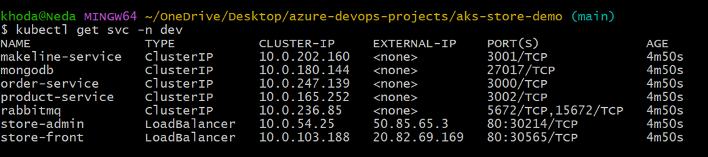

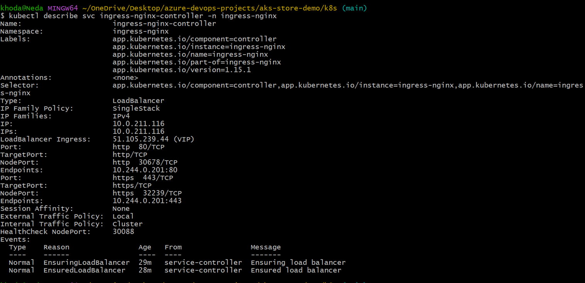

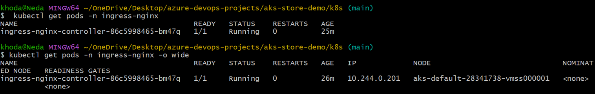

# NGINX Ingress Controller + External Access

The application was exposed externally using the NGINX Ingress Controller on AKS.

## Install NGINX Ingress Controller

```bash
kubectl create namespace ingress-basic
```

```bash
helm repo add ingress-nginx https://kubernetes.github.io/ingress-nginx
helm repo update

helm install ingress-nginx ingress-nginx/ingress-nginx \
  --namespace ingress-basic \
  --set controller.replicaCount=1
```

## Verify Ingress Controller

```bash
kubectl get pods -n ingress-basic
kubectl get svc -n ingress-basic
```

The LoadBalancer service automatically received a public external IP address from Azure.

---

# Frontend Service Creation

During troubleshooting it was discovered that the `store-front` Kubernetes Service was missing.

A manual ClusterIP service was created for the frontend application.

## Create Frontend Service

File:

```text
k8s/store-front-service.yaml
```

YAML:

```yaml
apiVersion: v1
kind: Service

metadata:
  name: store-front
  namespace: dev

spec:
  selector:
    app: store-front

  ports:
    - protocol: TCP
      port: 80
      targetPort: 8080

  type: ClusterIP
```

Apply:

```bash
kubectl apply -f k8s/store-front-service.yaml
```

---

# Kubernetes Ingress Resource

## Create Ingress File

File:

```text
k8s/store-front-ingress.yaml
```

YAML:

```yaml
apiVersion: networking.k8s.io/v1
kind: Ingress

metadata:
  name: store-front-ingress
  namespace: dev

spec:
  ingressClassName: nginx

  rules:
  - http:
      paths:
      - path: /
        pathType: Prefix

        backend:
          service:
            name: store-front
            port:
              number: 80
```

## Apply Ingress

```bash
kubectl apply -f k8s/store-front-ingress.yaml
```

## Verify Ingress

```bash
kubectl get ingress -n dev
```

---

# AKS to ACR Authentication Troubleshooting

During deployment the application encountered:

- ImagePullBackOff
- ErrImagePull
- 401 Unauthorized
- Helm timeout issues

The issue was caused by missing permissions between AKS and Azure Container Registry.

## Verify ACR Repository

```bash
az acr repository list --name acraksstoredemo12345 --output table
```

## Get ACR Resource ID

```bash
az acr show \
  --name acraksstoredemo12345 \
  --query id \
  --output tsv
```

## Get AKS Kubelet Identity

```bash
az aks show \
  --resource-group rg-aks-store-demo \
  --name aks-store-demo-cluster \
  --query identityProfile.kubeletidentity.objectId \
  -o tsv
```

## Assign AcrPull Role

```bash
az role assignment create --assignee "<AKS-KUBELET-IDENTITY>" \
  --role "AcrPull" \
  --scope "<ACR-RESOURCE-ID>"
```

After Azure role propagation completed, the pods successfully pulled images from ACR.

---


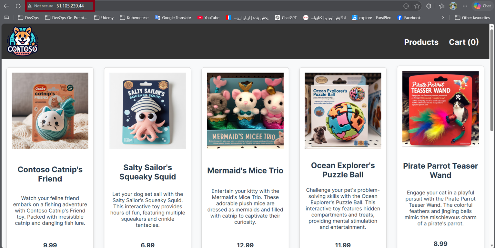

# Final Application Access

The application became accessible externally through the Azure LoadBalancer public IP:

```text
http://20.126.219.199
```


---


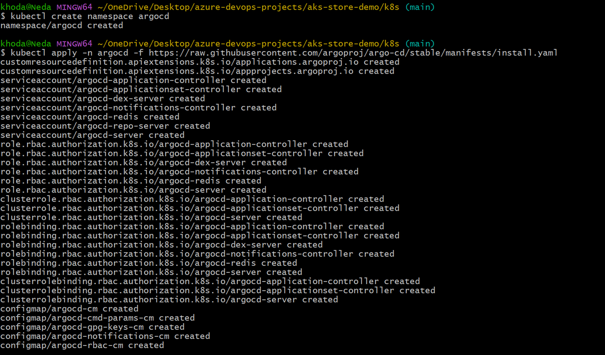

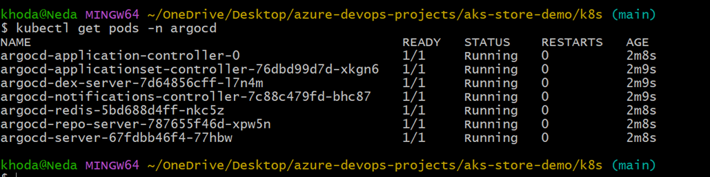

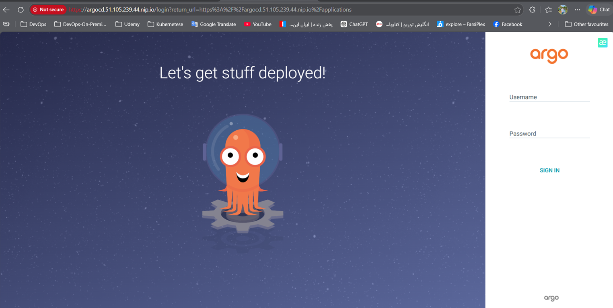

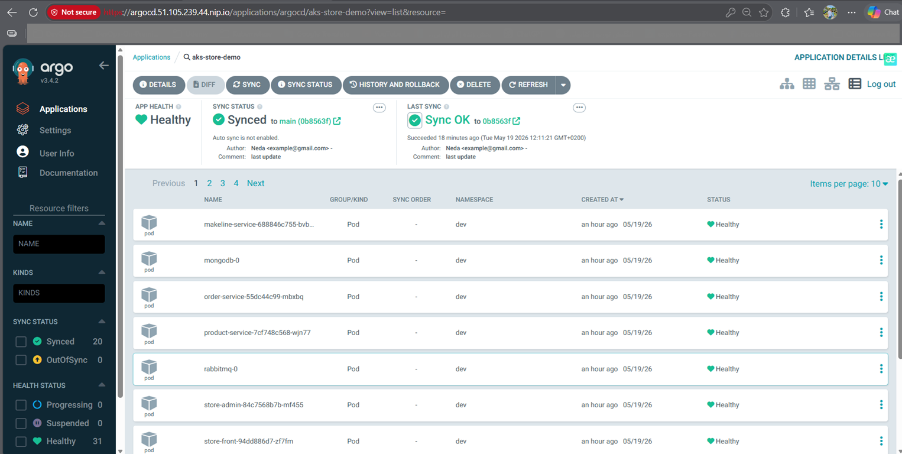

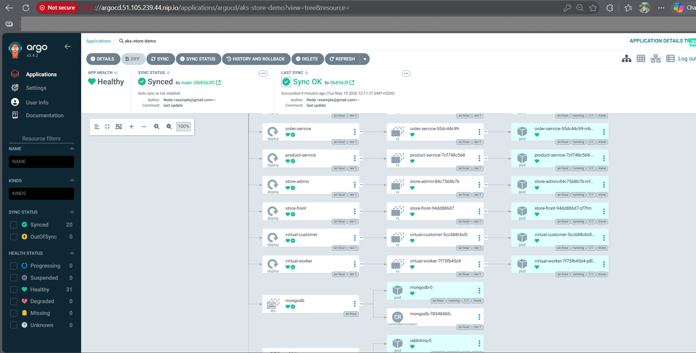

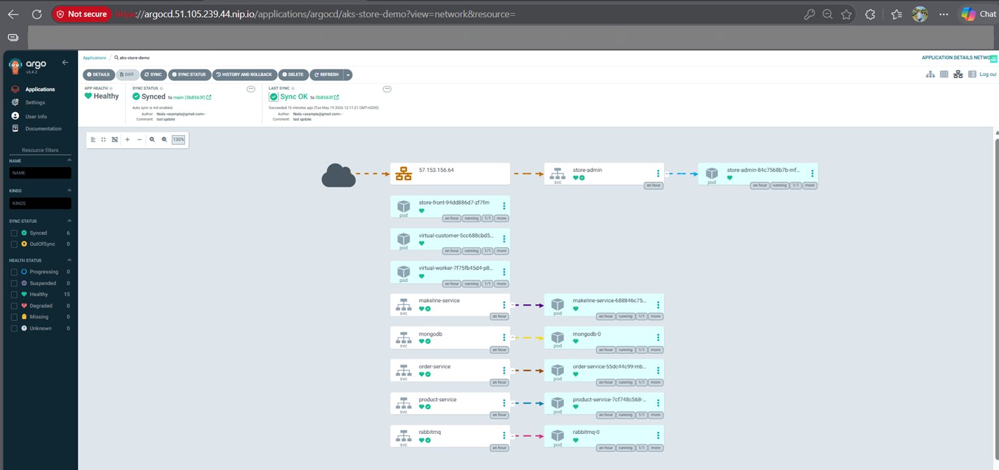

# GitOps Deployment with Argo CD

Argo CD was added to the project to implement a production-style GitOps workflow on AKS.

The deployment flow became:

```text
Developer Push → GitHub → Argo CD → AKS
```

Argo CD continuously monitors the GitHub repository and automatically synchronizes Kubernetes resources with the desired state stored in Git.

---

# Argo CD Features Used

- GitOps workflow
- Automatic Kubernetes synchronization
- Self-healing deployments
- Automatic resource pruning
- Helm chart deployment support
- Kubernetes application visualization
- Continuous delivery on AKS

---

# Install Argo CD on AKS

## Create Namespace

```bash
kubectl create namespace argocd
```

## Install Argo CD

```bash
kubectl apply -n argocd -f https://raw.githubusercontent.com/argoproj/argo-cd/stable/manifests/install.yaml
```

## Verify Argo CD Pods

```bash
kubectl get pods -n argocd
```

---

# Expose Argo CD with NGINX Ingress

The project used the existing NGINX Ingress Controller to expose the Argo CD UI externally.

## Create Ingress File

File:

```text
k8s/argocd-ingress.yaml
```

YAML:

```yaml
apiVersion: networking.k8s.io/v1
kind: Ingress

metadata:
  name: argocd-ingress
  namespace: argocd

  annotations:
    nginx.ingress.kubernetes.io/backend-protocol: "HTTPS"

spec:
  ingressClassName: nginx

  rules:
    - host: argocd.51.105.239.44.nip.io

      http:
        paths:
          - path: /
            pathType: Prefix

            backend:
              service:
                name: argocd-server

                port:
                  number: 443
```

## Apply Argo CD Ingress

```bash
kubectl apply -f k8s/argocd-ingress.yaml
```

## Verify Ingress

```bash
kubectl get ingress -n argocd
```

---

# Access Argo CD UI

Argo CD became accessible through:

```text
https://argocd.51.105.239.44.nip.io
```

---

# Get Argo CD Admin Password

Default username:

```text
admin
```

Get the initial admin password:

```bash
kubectl -n argocd get secret argocd-initial-admin-secret \
-o jsonpath="{.data.password}" | base64 -d
```

---

# Create Argo CD Application

The AKS Store Demo Helm chart was connected directly to Argo CD.

## Repository Configuration

- Repository URL:

```text
https://github.com/nedakhodabakhshi/aks-store-demo-devops.git
```

- Git Revision:

```text
main
```

- Helm Chart Path:

```text
charts/aks-store-demo
```

- Target Namespace:

```text
dev
```

---

# Argo CD Synchronization

The application was synchronized manually for the first deployment.

After synchronization the application status became:

- Healthy
- Synced

Argo CD successfully deployed and managed all Kubernetes resources from the Git repository.

---

# Enable Auto Sync + Self Healing

Automatic synchronization and self-healing were enabled to create a fully automated GitOps workflow.

## Enable Auto Sync from UI

The following options were enabled:

- Enable Auto-Sync
- Prune Resources
- Self Heal

---

# Enable Auto Sync using kubectl

```bash
kubectl patch application aks-store-demo \
-n argocd \
--type merge \
-p '{"spec":{"syncPolicy":{"automated":{"prune":true,"selfHeal":true}}}}'
```

---

# Verify Auto Sync Configuration

```bash
kubectl get application aks-store-demo -n argocd -o yaml
```

Expected output:

```yaml
syncPolicy:
  automated:
    prune: true
    selfHeal: true
```

---

# GitOps Workflow Result

After enabling Auto Sync:

```text
git push
    ↓
Argo CD detects changes
    ↓
AKS deployment updates automatically
```

The Kubernetes cluster state is now continuously synchronized with the GitHub repository.

---

# Argo CD Self-Healing Test

A deployment was intentionally scaled down to verify self-healing.

## Scale Deployment to Zero

```bash
kubectl scale deployment store-front \
--replicas=0 \
-n dev
```

## Verify Pods

```bash
kubectl get pods -n dev
```

Argo CD automatically detected drift and restored the deployment state from Git.

---

# Final GitOps Architecture

The final production-style deployment workflow includes:

- Terraform Infrastructure Provisioning
- AKS Kubernetes Cluster
- Azure Container Registry
- Azure DevOps CI Pipeline
- Helm Deployments
- NGINX Ingress Controller
- Argo CD GitOps Continuous Delivery
- Automatic Kubernetes Synchronization
- Self-Healing Kubernetes Deployments

